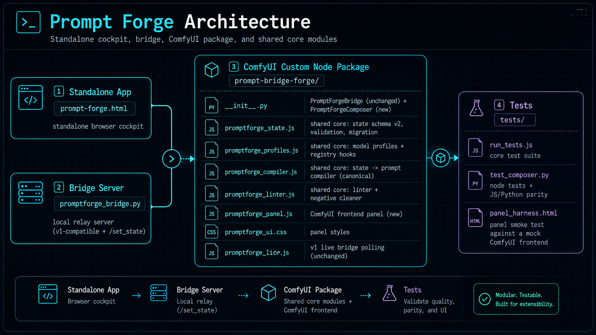

# Prompt Forge — Revised 

Prompt Forge turned from a single prompt form into a small control room for
image prompting: scenes on rails, model profiles, a linter, and a native
ComfyUI node + panel — while keeping every v1 workflow working.

No build step. No npm. Plain HTML/CSS/JS + Python. Copy files, restart
ComfyUI, done.

## Folder layout




**Important:** `prompt-forge.html` loads its compiler from
`prompt-bridge-forge/js/` — keep the folder together. If you move the HTML
file alone, it shows a clear error banner instead of silently breaking.

## Three ways to use it

### 1. Standalone browser (unchanged)

Open `prompt-forge.html`, build a prompt, copy it. Everything from v1 still
works: LLM enhance/draft (local server or Anthropic), presets (now
libraries), history, send-to-ComfyUI via API workflow export, bridge push.

New in v2: scene bar with a Global tab, field stacks with
enable/lock/weight/reorder, model profiles, output modes
(single / scenes joined / BREAK blocks), prompt health linter, inspector,
negative cleaner with category toggles and severity ladder, source-map view
(click a phrase → jump to its field), `{a|b|c}` wildcard variations,
history with favorites/notes/diff/state-restore, snapshots, project
import/export, preset packs, command palette (Ctrl+K), density modes.

### 2. Old bridge route (compatibility, unchanged)

```text
prompt-forge.html → promptforge_bridge.py → PromptForgeBridge node
```

Run `python promptforge_bridge.py`, add the **Prompt Forge Bridge** node,
wire its outputs into your text encoders. The browser app pushes on every
build; `promptforge_live.js` polls and fills `ai_positive` / `ai_negative`.
Nothing about this route changed.

### 3. Native ComfyUI route (path)

1. Copy `prompt-bridge-forge/` into `ComfyUI/custom_nodes/` and restart ComfyUI.
2. Click the **Prompt Forge** button (top menu, or the floating ⚒ button).
3. Create/select a **Prompt Forge Composer** node from the panel.
4. Edit scenes/fields/profile in the panel — live preview, no queueing needed.
5. Wire `positive` / `negative` outputs into your text encoders and queue.
6. Save the workflow. The full Prompt Forge state is stored inside the
   node's `state_json` widget — reload the workflow and everything returns.

Composer outputs: `positive`, `negative`, `positive_preview`,
`negative_preview`, `metadata_json`, `scene_json`.

Generic external inputs: `external_positive_a/b`, `external_negative_a`,
`external_metadata` accept a STRING from **any** node (caption tools,
trigger tools, whatever). Position is configurable
(forced prepend → before quality → forced append; default before quality),
exact-match dedupe only, non-ASCII preserved. Prompt Forge never inspects
where the text came from — there is intentionally no LoRA-specific logic
here (LoRA Trigger Tap remains fully independent).

Compile precedence at queue time (documented in `__init__.py`): connected
externals + parseable state → Python compiler (honors positions); otherwise
panel-written compiled widgets verbatim; otherwise state compile; otherwise
plain forced-text combiner. The JS compiler is canonical; the Python port is
a deliberate subset kept in parity by `tests/test_composer.py`.

## Migration from v1

On first load, if v1 localStorage data exists (draft, presets, history,
segments) and no v2 state does, the app migrates automatically:

- draft fields → scene/global fields (character checkbox → character field)
- presets → Libraries → Templates (apply them from the library list)
- history entries → v2 history
- multi-prompt segments → one scene each (segments UI is superseded by scenes)

**Old data is never deleted** — v1 keys stay in localStorage as a backup and
ride along inside "Backup all data" exports under `legacy`. The ComfyUI
workflow paste and bridge URL keys are shared with v1, so those survive too.

Removed/changed from v1: the click-to-cycle tag weight on the output box is
replaced by per-field weight inputs (profile-aware); the tag/natural toggle
is replaced by model profiles (Flux/Krea = natural language, no weights).

## Tests

```bash
node tests/run_tests.js         # 34 core tests: compiler, migration, linter…
python tests/test_composer.py  # 13 node tests incl. JS<->Python parity
# panel: serve the repo folder and open /tests/panel_harness.html
```

## Manual test checklist

Standalone: open `prompt-forge.html` → build a one-scene prompt → add a
second scene → switch output mode to "scenes joined" → export project JSON →
reload page → import project JSON → copy positive/negative.

Old bridge: run `promptforge_bridge.py` → ComfyUI with `PromptForgeBridge` →
confirm pushes still land in `ai_positive`/`ai_negative` and forced text
combines.

Native: add `PromptForgeComposer` → open panel → create/edit scenes →
confirm widgets update → wire outputs → queue → save workflow → restart
ComfyUI → reload → state persists.

External text: wire any STRING node into `external_positive_a` → confirm it
appears once at the configured position → confirm exact-duplicate phrases
dedupe → unplug it → scene compilation unaffected.

## Not implemented yet (clean TODOs, reserved in schema)

- Regional prompting (scene `regions[]` array is stored but ignored by the compiler)
- Batch queueing scenes/variants directly from the panel (render queue planner)
- Generation result tracker / thumbnails in history (`comfy` + `thumbnail`
  fields exist on history entries, nothing writes them yet)
- Wildcard pack files (`{file:...}` syntax) — inline `{a|b|c}` works
- Storyboard card grid (scene notes/status fields exist in state)
- ComfyUI user-directory storage for panel data (state lives in the workflow
  itself, which covers persistence; a user-data folder is a future nicety)
