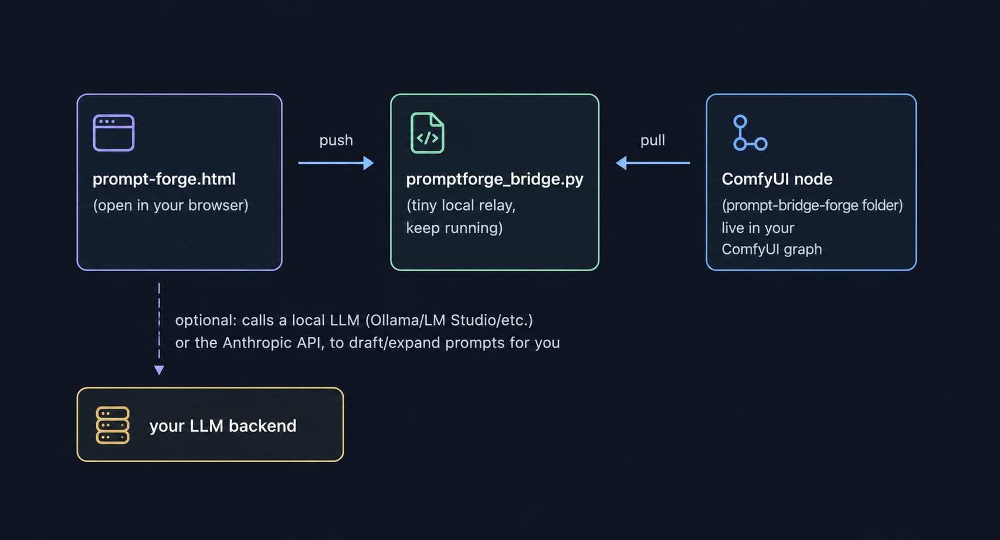

# Prompt Forge

A local prompt-building tool for Stable Diffusion / Krea 2 / ComfyUI. Build
prompts field-by-field, optionally have a local or cloud LLM draft/expand them
for you, and optionally push the result live into a running ComfyUI graph.

Nothing here requires an account, a build step, or installing anything beyond
Python (which most people doing local AI image generation already have). The
tool itself is a single HTML file you open in a browser.

## How the it fits together

There are three independent components. You only need the first one — the
other two are optional, for optional features.

```

```

- **`prompt-forge.html`** — the tool itself. This is all you need to build
  prompts by hand. Everything else below is optional.
- **AI-assisted drafting** (the "Enhance" and "Generate full draft" buttons) —
  optional. Needs a local LLM server running, or an Anthropic API key.
- **`promptforge_bridge.py` + the ComfyUI node** — optional. Lets a ComfyUI
  node update live as you build prompts in the browser, with no manual
  copy-paste. If you'd rather just export a workflow and let the tool queue it
  directly, see the "Send to ComfyUI" section instead — that doesn't need the
  bridge or the node at all.

---

## 1. Just using the tool (no AI, no ComfyUI integration)

Double-click `prompt-forge.html`. That's it — it opens in your default
browser and works immediately. Build fields on the left, copy the result on
the right. Nothing else in this document is required for this to work.

---

## 2. Connecting a local LLM (for "Enhance" / "Generate full draft")

This is the part that trips people up, because of a browser security rule
called **CORS**. Here's the one sentence that explains all of it: **a webpage
can't talk to a local server unless that server explicitly says it's okay.**
`prompt-forge.html` is a webpage (even though it's just a file on your
computer), so whichever LLM server you use has to be told to allow it. This
isn't a bug in the tool — every browser-based app that talks to a local LLM
hits this same wall.

Pick whichever backend you actually use:

### Ollama

Ollama has no settings UI for this — it's an environment variable that must
be set **before** the server starts.

**Windows:**
1. Fully quit Ollama first — right-click its tray icon → Quit. If you ever
   ran `ollama serve` manually in a terminal too, close that as well. (Two
   copies of Ollama can end up running at once otherwise, and you'll keep
   talking to the wrong one.)
2. Search "Environment Variables" in the Start menu → Edit the system
   environment variables → New (user or system variable):
   - Name: `OLLAMA_ORIGINS`
   - Value: `*`
3. Relaunch Ollama from the Start menu so it picks up the new variable.

**macOS (menu-bar app):**
```bash
launchctl setenv OLLAMA_ORIGINS "*"
```
Then fully quit and reopen the Ollama app.

**Linux, running `ollama serve` manually:**
```bash
OLLAMA_ORIGINS=* ollama serve
```

**Linux, running as a systemd service:**
```bash
sudo systemctl edit ollama.service
```
Add under `[Service]`:
```
Environment="OLLAMA_ORIGINS=*"
```
Then:
```bash
sudo systemctl daemon-reload
sudo systemctl restart ollama
```

**Verify it actually worked**, without touching the browser at all:
```bash
curl -X OPTIONS http://localhost:11434/api/chat -H "Origin: http://example.com" -H "Access-Control-Request-Method: POST" -I
```
Look for `Access-Control-Allow-Origin` in the response. If it's missing, the
variable didn't reach the running process — usually because it wasn't fully
restarted, or was set in a terminal that isn't the one actually running the
server.

**In the tool:** Backend = Local server, format = Ollama native
(`/api/chat`), Base URL = `http://127.0.0.1:11434` (or `http://localhost:11434`
— see the note on IP addresses further down if Ollama is on a *different*
computer than the browser).

### LM Studio

LM Studio has an actual UI toggle for this, unlike Ollama.

1. Open LM Studio → the server/developer tab where you start the local
   server.
2. Find **"Enable CORS"** and turn it on.
3. If you're going to reach it from a different computer, also enable
   **"Serve on Local Network."** If this is off, no other device can reach
   it at all — CORS being enabled doesn't matter if the server isn't even
   listening beyond your own machine.
4. Restart the server (stop and start it again in LM Studio's UI) so the
   settings actually apply.

**In the tool:** format = OpenAI-compatible (`/v1/chat/completions`), Base URL
= `http://127.0.0.1:1234` (the port LM Studio shows you), or the machine's LAN
IP if it's on a different computer.

### llama.cpp server / text-generation-webui / vLLM / other OpenAI-compatible servers

These vary, but look for a `--cors` flag or a config option with "CORS" or
"allow-origin" in the name, and pass it when launching the server. Consult
that specific project's docs for the exact flag name.

**In the tool:** format = OpenAI-compatible (`/v1/chat/completions`), Base URL
= wherever that server is actually listening.

### Anthropic API (cloud — no local server, no CORS setup needed)

Backend = Anthropic API. Paste your API key and pick a model. This calls
`api.anthropic.com` directly from your browser using your own key — nothing
to configure on a server, since there's no local server involved. Just don't
share the HTML file with your key still typed into it.

### If your LLM server is on a *different computer* than the browser

`127.0.0.1` and `localhost` **always** mean "this machine" — never a remote
one, no matter how the server is configured. If your LLM is running on
another computer on your network, you need that machine's actual LAN IP
(something like `192.168.1.x`), not `127.0.0.1`. This is unrelated to CORS —
even with CORS perfectly configured, `127.0.0.1` will never reach a different
computer.

---

## 3. The bridge server (for live ComfyUI sync)

Only needed if you want a ComfyUI node's text fields to update live as you
build prompts, without manually copying anything.

1. Make sure you have Python installed (any recent version).
2. Open a terminal in the folder containing `promptforge_bridge.py` and run:
   ```
   python promptforge_bridge.py
   ```
3. You should see:
   ```
   Prompt Forge bridge running on http://127.0.0.1:8199
   ```
   Leave this terminal window open — closing it stops the bridge. No
   installation, no dependencies beyond Python itself.
4. In the HTML tool's "Bridge to custom node" section, the URL should already
   default to `http://127.0.0.1:8199`, matching the port above. If you ever
   need a different port: `python promptforge_bridge.py 9000`, and update the
   URL field in the tool to match.

---

## 4. The ComfyUI custom node (for live sync)

1. Copy the **entire** `prompt-bridge-forge` folder into
   `ComfyUI/custom_nodes/`. Don't cherry-pick individual files out of it —
   copy the whole folder, keeping its internal structure exactly as-is:
   ```
   custom_nodes/
     prompt-bridge-forge/
       __init__.py
       js/
         promptforge_live.js
   ```
   That `js` subfolder specifically has to exist with that exact name — it's
   how ComfyUI knows to load the live-update script. If it's missing,
   renamed, or flattened, the node still works when you queue a generation,
   but the *live* preview (updating before you hit Queue) silently won't.

2. **Fully restart ComfyUI** — quit the actual process and relaunch it. A
   browser refresh alone does not pick up a newly added custom node.

3. In your ComfyUI graph, add the **"Prompt Forge Bridge"** node (search for
   it, or find it under the "Prompt Forge" category). Wire its `positive` and
   `negative` STRING outputs into your CLIPTextEncode (or Krea 2/Qwen-Image
   text-encode) nodes.

4. With `promptforge_bridge.py` running (step 3 above) and the HTML tool's
   "Auto-push" checkbox on, every prompt you build should appear in the
   node's `ai_positive`/`ai_negative` fields within about a second — no need
   to queue anything to see it.

5. The node also has `forced_positive` / `forced_negative` fields — anything
   typed there always gets included regardless of what the HTML tool sends,
   useful for a fixed style tag or boilerplate quality tags you never want to
   accidentally lose.

**If the live update doesn't work but the node still functions when queued:**
that's almost always the `js` folder issue from step 1. Open your browser's
dev tools (F12) → Console tab while ComfyUI is open, and look for a line
starting with `[PromptForge.Live]`. If you don't see it at all, the script
never loaded — double-check the folder structure above and that you did a
full restart, not a refresh.

---

## 5. Alternative: sending straight to ComfyUI's queue (no bridge, no node)

If you don't want to install the custom node at all, the HTML tool can queue
a generation directly:

1. In ComfyUI, export your workflow in **API format** (Workflow menu →
   Export (API) — this is different from the normal "Save" export).
2. Launch ComfyUI with CORS enabled: add `--enable-cors-header "*"` to however
   you start it.
3. In the HTML tool's "Send to ComfyUI" section, paste that exported JSON and
   click Parse — it'll find your text-encode nodes and let you pick which is
   positive/negative.
4. "Send to ComfyUI" queues the generation immediately using your currently
   built prompt.

This is simpler to set up than the bridge+node (no ComfyUI restart, no extra
file to install), but you have to re-export and re-paste the workflow JSON
any time you change your ComfyUI graph. The bridge+node approach in sections
3–4 stays in sync automatically instead.

---

## Troubleshooting

**"Failed to fetch" / "NetworkError" when clicking Enhance or Generate full
draft:** almost always CORS not enabled on your LLM backend, or the wrong
base URL. See section 2 above for your specific backend.

**A ComfyUI extension file 404s or won't load:** check the exact folder
structure in section 4 — a missing or misnamed `js` subfolder is the single
most common cause.

**Everything was working, then suddenly wasn't, after any of these were
running for a while:** confirm each piece is actually still running —
`promptforge_bridge.py`'s terminal window, your LLM server, and ComfyUI
itself. Closing a terminal window stops whatever was running in it.

**Trying to reach a server on a different computer and nothing connects:**
see the `127.0.0.1` vs LAN IP note at the end of section 2.

---
